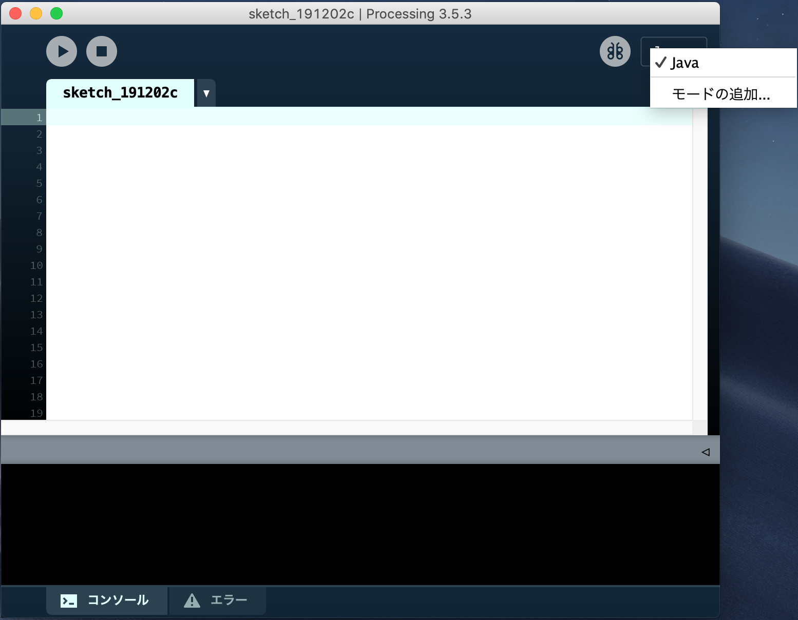
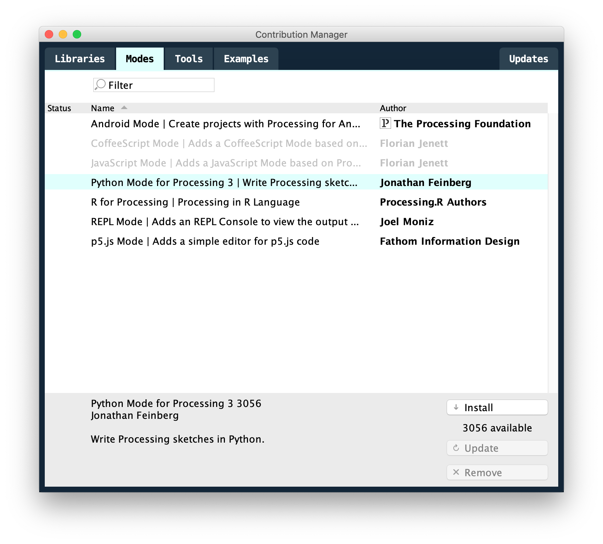
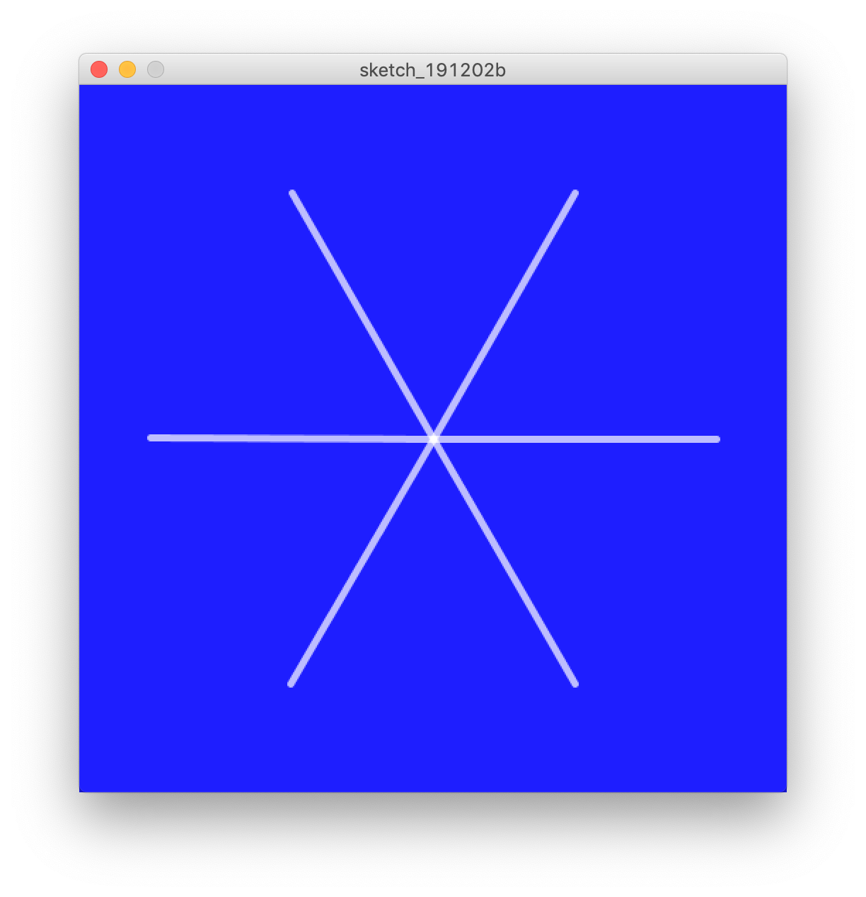
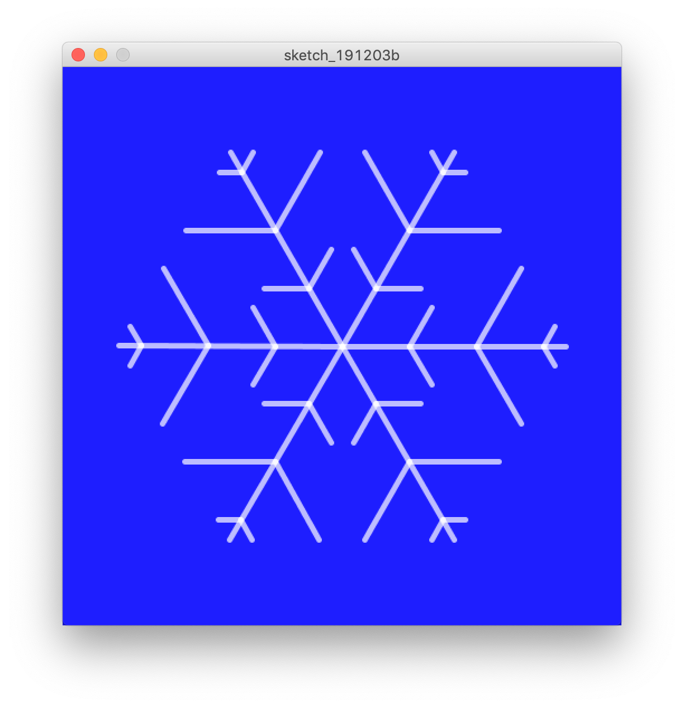
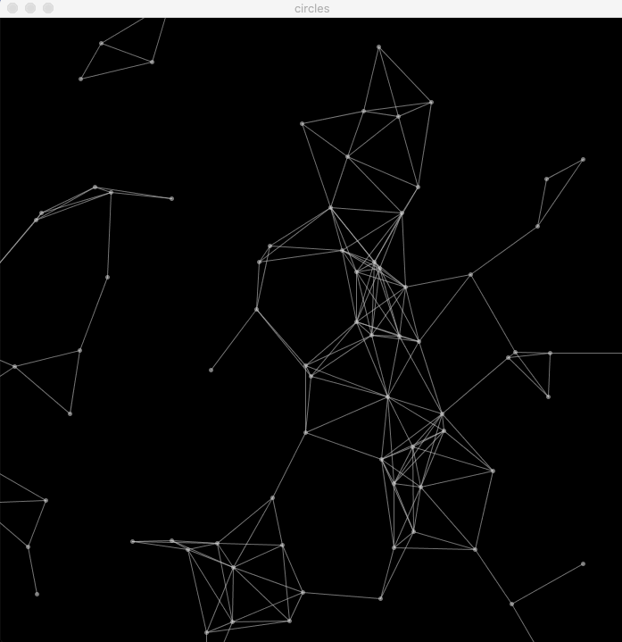

Title: PythonでGenerative Art入門
Tags: python, generative art
Summary: Pyladies Japan Advent Calender 2019の記事です。PythonでGererative Artに入門してみましょう。

この記事は[Pyladies Japan Advent Calendar 2019](https://adventar.org/calendars/4730)の6日目の記事です。

同僚のPyladiesスタッフに「なんでもいいから記事書いて」と言われたので気軽に書いてみます！
私自身は男性なのでPyladiesに参加したことはありませんが、色々な分野のテーマで開催されていて、楽しそうで羨ましく感じています。

今回は、Pythonを使ってGererative Artに入門する方法について紹介します！

### 目次

- [お前誰よ](#whoareyou)
- [Generative Artとは](#intro)
- [Python Mode for Processing導入方法](#install)
- [雪の結晶を描いてみよう](#snowflake)
- [まとめ](#conclusion)


<h2 id='whoareyou'>お前誰よ</h2>

- @meganehouser
- 男性です
- 職種: Software Developer
- お仕事: Python/Django/Django REST Framework/Angular/TypeScript
- [Meguro.LYAHFGG - connpass](https://megurolyahfgg.connpass.com/)主催

プライベートでは最近はRustを書いたりしています。

<h2 id='intro'>Generative Artとは</h2>

「ジェネラティブ・アートとは、コンピュータを使い、創造のプロセスの一部に意図的に偶然性を取り入れたプログラムで作られたアートのことである。」 ([ジェネラティブ・アートを愛する理由 - lab.sugimototatsuo.com](https://lab.sugimototatsuo.com/2018/09/why-love-generative-art/))

どんなものかピンと来ない場合はGoogle画像検索で作品をみてみましょう。感じがつかめると思います。

- [generative art - Google 検索](https://www.google.com/search?q=generative+art&tbm=isch)


<h2 id='install'>Python Mode for Processing 導入方法</h2>

この記事ではProcessingのPython Modeで作品を作ってみます。
Processingは電子アートとビジュアルデザインのための統合開発環境です。
簡単にいえば、プログラミングでお絵かきができるソフトウェアと考えてください。
デフォルトではJavaを単純化した言語を使用しますが、プラグインをインストールすることによってPython2.7でProcessingを使用できるようになります。

ん、Python2系はもうすぐお亡くなりになるはずでは。

これはPython Modeが裏側でJythonを使っているためです。最近はJythonはあまり活発に開発されていません……。

でもProcessingで簡単なプログラムを書くのには特に困ることはありません（たぶん）。
とにかくここでは一旦気にせずProcessingとPython Mode for Processingをインストールしてみましょう。

#### 1. Processingのインストール

以下のページからインストーラをダウンロードしてインストール。
(Windows/Linux/Mac OSXに対応しています。)

[https://processing.org/download/](https://processing.org/download/)

#### 2. Python Mode for Processingのインストール
Processingを起動して、画面右上のメニュー「モードの追加」をクリック。


「Python Mode for Processing 3」を選択してinstallボタンをクリック。


#### 3. 実行
モードを「Python」に変更、エディタ部にプログラムを書いて実行すると、実行結果が別ウインドウで表示されます。


<h2 id='snowflake'>雪の結晶を描いてみよう</h2>

クリスマスっぽいので雪の結晶を描いてみます。

わからない命令があれば[Processing.py Reference](https://py.processing.org/reference/)を参照してください。

#### 1. 軸を6本描いてみる
以下をProcessingのエディタ部に入力して実行してみてください。
```python
def setup(): # 起動時に一度だけ実行される関数
    size(500, 500) # 結果表示するウインドウのサイズを設定
    background(30, 30, 255) # 背景色を設定
    strokeCap(ROUND) # ラインの先端の形状を設定
    strokeWeight(5) # ラインの太さを設定
    stroke(255,255,255, 180) # 描画色を設定(R,G,B,Alpha)
    center = width / 2, height / 2 # widthとheightは実行時のウインドウサイズを保持
    translate(center[0], center[1]) # 座標の移動(画面の中央をx=0, y=0になるように変形)

    for _ in range(6):
        line(0, 0, 200, 0) # 線を引く
        rotate(PI / 3) # 座標の回転
```

6本の軸が表示されました。


ポイントは`translate`と`rotate`です。`translate`で原点を画面中央に移動し、`rotate`で30°ずつ座標を回転させ、`line`を呼び出すことで、放射状に線を引いています。

`rotate`はラジアンを引数に取るため一周は`2 * PI`となり、30°は`PI / 3`になります。

#### 2. 軸から枝を生やしてみる
6本の軸から枝を生やしてみましょう。

```python
def draw_branch(branch_len, direction):
    pushMatrix()  # 座標の状態の保存
    rotate(direction * PI / 3)
    line(0, 0, branch_len, 0) 
    popMatrix()  # 座標系の状態のリストア

def setup():
    size(500, 500)
    background(30, 30, 255)
    strokeCap(ROUND)
    strokeWeight(5)
    stroke(255,255,255, 180)
    center = width / 2, height / 2
    translate(center[0], center[1])
    
    for _ in range(6):
    	line(0, 0, 200, 0)
    
    	pushMatrix()  # 座標の状態の保存
        for branch_len in [40, 80, 20]:
            translate(60, 0)
            draw_branch(branch_len, 1)
            draw_branch(branch_len, -1)
        popMatrix()  # 座標の状態のリストア
        rotate(PI / 3)
```



ポイントは`pushMatrix`と`popMatrix`です。`pushMatrix`は座標の状態をマトリックススタックにプッシュし、`popMatrix`は座標の状態をマトリックススタックからポップして復元します。

簡単に言うと、`popMatrix`を呼び出すと、`translate`や`rotate`で変形した座標系を`pushMatrix`した状態まで戻すことができます。

`draw_branch`関数では座標を60°(または-60°)回転させて枝を書き、座標系を復元して復帰しています。

### 3. 偶然性

Generative Artとは意図的に偶然性を取り入れた作品なのでした。

私たちの雪の結晶は今のところ偶然性がありません。取り入れましょう。

偶然性（ランダム）を取り入れた完成形のソースが以下です。
<script src="https://gist.github.com/meganehouser/fbc7a7ba42b91fe1416cbb82a46fd36c.js"></script>

軸から枝を生やす位置と、枝の長さをランダムにしました。
実行するたびに微妙に異なった形の雪の結晶が表示されるはずです。


何度か実行させてみると、枝の角度を変えてみたり、枝が重ならないように制限をかけるなど、改良をしてみたくなるかもしれません。
そうして修正を加えたら、もうあなたはGenerative Artの入門の次の一歩を踏み出しています。


<h2 id='conclusion'>まとめ</h2>

ProcessingとPython Mode for Processingを使って、簡単にGenerative Artに入門することができました。

この記事では言及していませんが、Processingでは図形をアニメーションすることも簡単にできます。

例えば、以下のように。


AI系のWebサイトの背景とかで見かけたりするパターンです。
みていると複雑なパターンを描いていて飽きませんが、仕組みは単純です。

円周上を動く点をランダムに配置し、点と点が近くなったら線を引いています。
コードは以下の通り。
<script src="https://gist.github.com/meganehouser/7b0dd1a42aae32830d6bd47544d37086.js"></script>

Processingではアイディアをすぐ形にしてみることができます。
ぜひ、あなただけの作品を作ってみてください。

Generative Artに興味を持たれた方は以下の書籍も当たってみてください。

- [[普及版]ジェネラティブ・アート―Processingによる実践ガイド | マット・ピアソン, Matt Pearson, 久保田 晃弘, 沖 啓介 |本 | 通販 | Amazon](https://www.amazon.co.jp/dp/4861009634/)


